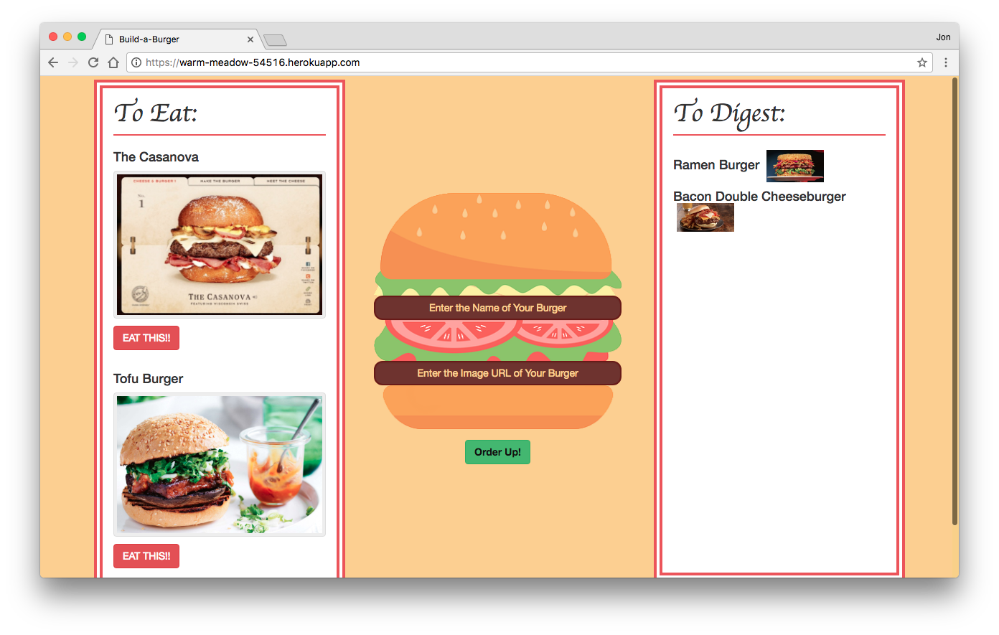

# EatDaBurger
EatDaBurger is a full-stack application that allows you to enter burgers and track their consumption. It is live at https://warm-meadow-54516.herokuapp.com/.

## Description

EatDaBurger has two lists: one with burgers you would like to eat, and another for burgers you have eaten. In the center, users can enter new burgers with their name and picture, after which they will appear on the list to be eaten. The user can also mark off those that they have eaten which will move that burger to the consumed list. The consumed list can be cleared by pressing at tnhe reset button at the bottom left, which will move all burger back to the "To Eat" list. Burger states are stored using a MySQL database, and thus are the consistent after closing and reopening the page. Once added to the page, burgers cannot be removed without directly accessing the database.

### Development

This application was developed as part of the GW Coding Bootcamp and was completed at the end of the seventh week. It is a full-stack application organized with proper MVC design. The front-end uses Express-Handlebars as well as Bootstrap and its jQuery. The back-end uses Express, Body-Parser, MethodOverride, and a custom ORM to connect to the MySQL database.

### Organization

This repo can be cloned to your computer and accessed using the following commands:

		git clone https://github.com/jonchr/EatDaBurger.git
		cd EatDaBurger
		
Before running one of the application files, you should set up the required tables in MySQL. This can be done with the command:

		node db/schema.sql
		node db/seeds.sql

After that, the server can be run with the following command

		node server.js

This will run the local server and will print the message "Running on PORT 3000" when completed. Once you receive this message, open "localhost:3000" in your browser. To stop the server, press Control-C while in your command prompt window.

## Screenshots
### So many mouth-water burgers!
